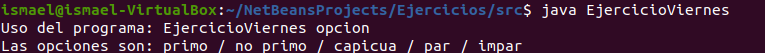

# Ejercicio Ficheros
Para este ejercicio de ficheros he optado por mejorar el ejercicio 1 de la relación del tema 11.

Primero deberemos de entrar en la consola y usar el siguiente comando para compilar el fichero java a un .class

```javac
javac EjercicioViernes.java
```

Lo que nos dará como resultado un .class.
Al hacer java al .class nos dará el siguiente resultado en caso de no meter parametros.



Con esto nos dirá cuales son las opciones disponibles del programa, dependiendo de la cual elijamos nos dará los números que cumplan la opción elegida del 1 al 500.

Estos son los ficheros creados por el programa en función de la opción elegida:

- [Primo](primo.dat)
- [No Primo](no_primo.dat)
- [Capicúa](capicua.dat)
- [Par](par.dat)
- [Impar](impar.dat)

> :star: Si te ha gustado este programa tan simple, dale una estrellita al [repositorio](https://github.com/ismaelpacheco13/ejercicioViernesFicheros).


